# ESP32 Bit Pirate

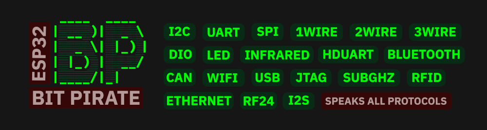


**ESP32 Bit Pirate** is an open-source firmware that turns your device into a multi-protocol hacker's tool, inspired by the [legendary Bus Pirate](https://buspirate.com/).

It supports sniffing, sending, scripting, and interacting with various digital protocols (I2C, UART, 1-Wire, SPI, etc.) via a serial terminal or web-based CLI. It also communicates with radio protocols like Bluetooth, Wi-Fi, Sub-GHz and RFID.

Use the [ESP32 Bit Pirate Web Flasher](https://geo-tp.github.io/ESP32-Bit-Pirate/webflasher/) to install the firmware in one click. See the [Wiki](https://github.com/geo-tp/ESP32-Bit-Pirate/wiki) for step-by-step guides on every mode and command. Check [ESP32 Bit Pirate Scripts](https://github.com/geo-tp/ESP32-Bit-Pirate-Scripts) for a collection of scripts.

For hardware extensions, see the [ESP32 Bus Expander](https://github.com/geo-tp/ESP32-Bus-Expander) for additional radio interfaces, and the [ESP32 Bit Pirate Dock](https://github.com/AndreiVladescu/ESP32-Bit-Pirate-Dock) to use original [Bus Pirate](https://buspirate.com/) adapters and accessories.

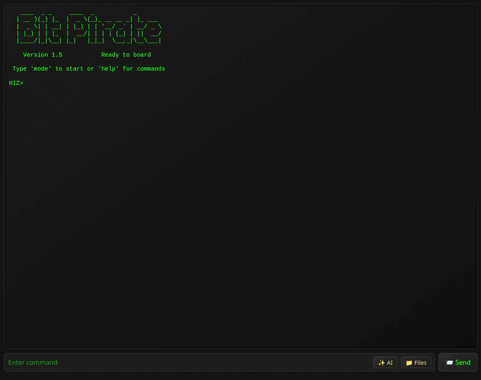
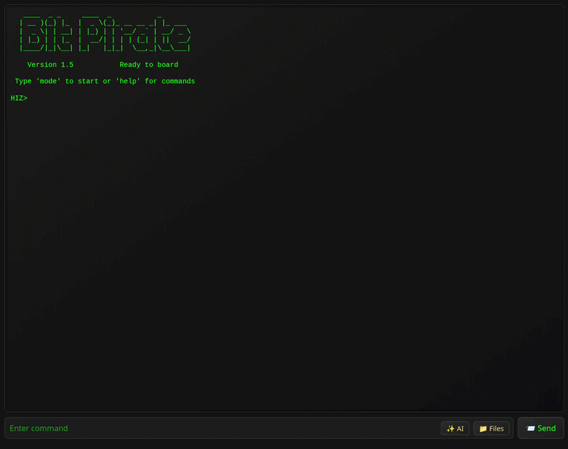

## Features

- Interactive command-line interface (CLI) via **USB Serial or WiFi Web**.
- **Modes for:**
   - [HiZ](https://github.com/geo-tp/ESP32-Bit-Pirate/wiki/01-HiZ) (default)
   - [I2C](https://github.com/geo-tp/ESP32-Bit-Pirate/wiki/05-I2C) (scan, glitch, slave mode, dump, eeprom)
   - [SPI](https://github.com/geo-tp/ESP32-Bit-Pirate/wiki/06-SPI) (eeprom, flash, sdcard, slave mode)
   - [UART](https://github.com/geo-tp/ESP32-Bit-Pirate/wiki/03-UART) / [Half-Duplex UART](https://github.com/geo-tp/ESP32-Bit-Pirate/wiki/04-HDUART) (bridge, read, write)
   - [1WIRE](https://github.com/geo-tp/ESP32-Bit-Pirate/wiki/02-1WIRE) (ibutton, eeprom)
   - [2WIRE](https://github.com/geo-tp/ESP32-Bit-Pirate/wiki/07-2WIRE) (sniff, smartcard) / [3WIRE](https://github.com/geo-tp/ESP32-Bit-Pirate/wiki/08-3WIRE) (eeprom)
   - [DIO](https://github.com/geo-tp/ESP32-Bit-Pirate/wiki/09-DIO) (Digital I/O, read, pullup, set, pwm)
   - [Infrared](https://github.com/geo-tp/ESP32-Bit-Pirate/wiki/11-INFRARED) (send, record, universal remote)
   - [USB](https://github.com/geo-tp/ESP32-Bit-Pirate/wiki/12-USB) (HID, flashrom, storage, usb-uart)
   - [Bluetooth](https://github.com/geo-tp/ESP32-Bit-Pirate/wiki/13-BLUETOOTH) (BLE HID, scan, spoofing, sniffing)
   - [Wi-Fi](https://github.com/geo-tp/ESP32-Bit-Pirate/wiki/14-WIFI) / [Ethernet](https://github.com/geo-tp/ESP32-Bit-Pirate/wiki/18-ETHERNET) (sniff, deauth, nmap, netcat)
   - [JTAG](https://github.com/geo-tp/ESP32-Bit-Pirate/wiki/15-JTAG) (scan, SWD, openOCD)
   - [LED](https://github.com/geo-tp/ESP32-Bit-Pirate/wiki/10-LED) (animations, set LEDs)
   - [I2S](https://github.com/geo-tp/ESP32-Bit-Pirate/wiki/16-I2S) (test speakers, mic, play sound)
   - [CAN](https://github.com/geo-tp/ESP32-Bit-Pirate/wiki/17-CAN) (sniff, send and receive frames)
   - [SUBGHZ](https://github.com/geo-tp/ESP32-Bit-Pirate/wiki/19-SUBGHZ) (analyze, record, replay)
   - [RFID](https://github.com/geo-tp/ESP32-Bit-Pirate/wiki/20-RFID) (read, write, clone)
   - [RF24](https://github.com/geo-tp/ESP32-Bit-Pirate/wiki/21-RF24) (scan, send, receive)
   - [FM](https://github.com/geo-tp/ESP32-Bit-Pirate/wiki/22-FM) (analyze, broadcast)
   - [CELL](https://github.com/geo-tp/ESP32-Bit-Pirate/wiki/23-CELL) (dump sim card, sms, call)


- **Protocol sniffers** I2C, UART, SPI, 1Wire, 2wire, CAN, Wi-Fi, Bluetooth, SubGhz.
- Baudrate **auto-detection**, AT commands and various tools for UART.
- Registers manipulation, **EEPROM dump tools**, identify devices for I2C.
- Read all sort of **EEPROM, Flash** and various others tools for SPI.
- Scripting using **Bus Pirate-style bytecode** instructions or **Python**.
- Device-B-Gone command with more than **80 supported INFRARED protocols**.
- Direct I/O management, **PWM, servo, GPIOs state**.
- Analyze radio signals and frequencies **on every bands**.
- Near than **50 addressable LEDs protocols** supported.
- **Ethernet and WiFi** are supported to access networks.
- Import and export data with the **LittleFS over HTTP.**
- **Pirate assistant** to help you with the firmware.
- **USB-Uart dongle, SPI programmer, logic analyzer** and more.
- [**Web Serial tools**](https://geo-tp.github.io/ESP32-Bit-Pirate/web-tools/) to use USB Serial over a web browser.

## Supported Devices


| Device               |                                     | Description                       |
|-----------------------|------------------------------------------|---------------------------------------------------|
| **ESP32 S3 Dev Kit**  |      | More than 20 available GPIO, 1 button |
| **LILYGO T-Display** |  | 13 GPIO (1 Qwicc), screen, 2 buttons |
| **LILYGO T-Embed**    |           | 9 GPIO (Grove, Header), screen, encoder, speaker, mic, SD card                                         |
| **LILYGO T-Embed CC1101** |  | 4 GPIO (2x Qwiic), screen, encoder, speaker, mic, SD Card, CC1101, PN532, IR TX, IR RX , battery                                 |
| **LILYGO T-Embed CC1101 Plus** |  | 4 GPIO (2x Qwiic), screen, encoder, speaker, mic, SD Card, CC1101, NRF24, PN532, IR TX, IR RX , battery                                 |
| **M5 AtomS3 Lite**    |             | 8 GPIO (Grove, Header), IR TX, 1 buttton                  |
| **M5 Cardputer**      |             | 2 GPIO (Grove), screen, keyboard, mic, speaker, IR TX, SD card, battery, [standalone mode](#standalone-mode-for-the-cardputer)            |
| **M5 Cardputer ADV**  |     | 12 GPIO (Grove, Header), screen, keyboard, mic, speaker, IR TX, SD card, IMU, battery, [standalone mode](#standalone-mode-for-the-cardputer)                  |
| **M5 StampS3**        |              | 9 GPIO (exposed pins), 1 button                       |
| **M5 Stick S3** |       | 13 GPIO (Grove, Header), screen, mic, speaker, IR TX, IR RX, IMU, 3 buttons, battery                 |
| **Seeed Studio Xiao S3** |         | 9 GPIO (exposed pins), 1 button |
| **ESP32-S3 Super Mini**   | 18-pin castellated S3-MINI-1U module | 4 MB flash, 2 MB PSRAM, native USB, dual-core 240 MHz |

- **Other ESP32-S3-based Boards**

  - All boards based on the **ESP32-S3 can be supported**, provided they have at least **4 MB of flash.**

  - You can **flash the s3 dev-kit firmware onto any ESP32-S3 board.**

  - Keep in mind that the **default pin mapping in the firmware may not match** your specific board.

## Getting Started

[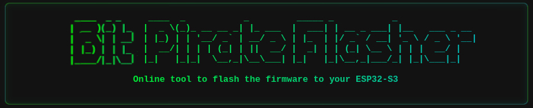](https://geo-tp.github.io/ESP32-Bit-Pirate/webflasher/)

1. 🔧 Flash the firmware
   - Use the [ESP32 Bit Pirate Web Flasher](https://geo-tp.github.io/ESP32-Bit-Pirate/webflasher/) to burn the firmware directly from a web browser.
   - You can also burn it on [M5Burner](https://docs.m5stack.com/en/download), in the StickS3, AtomS3, M5StampS3 or Cardputer category.

2. 🔌 Connect via Serial or Web
   - Serial: any terminal app, or the [free browser-based Web Serial terminal](https://geo-tp.github.io/ESP32-Bit-Pirate/web-tools/web-serial-terminal/) (see [Connect via Serial](https://github.com/geo-tp/ESP32-Bit-Pirate/wiki/99-Serial))
   - Web: configure Wi-Fi and access the CLI via browser (see [Wi-Fi Connection](https://github.com/geo-tp/ESP32-Bit-Pirate/wiki/00-Terminal))

3. 🧪 Use commands like:
   ```
   mode
   help
   scan
   sniff
   ...
    ```

## Wiki

[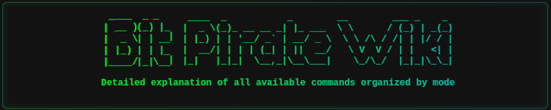](https://github.com/geo-tp/ESP32-Bit-Pirate/wiki/)

📚 **[Visit the Wiki](https://github.com/geo-tp/ESP32-Bit-Pirate/wiki)** for detailed documentation on every mode and command.

Includes:
- [Terminal mode](https://github.com/geo-tp/ESP32-Bit-Pirate/wiki/00-Terminal) - About serial and web terminal.
- [Mode overviews](https://github.com/geo-tp/ESP32-Bit-Pirate/wiki) - Browse supported modes.
- [Serial setup](https://github.com/geo-tp/ESP32-Bit-Pirate/wiki/99-Serial) - Serial access via USB.

The wiki is the best place to learn how everything works.

## Scripting

[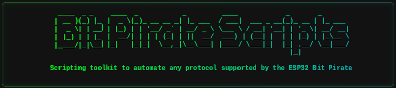](https://github.com/geo-tp/ESP32-Bit-Pirate-Scripts/)

🛠️ [**Automate interactions with the ESP32 Bit Pirate**](https://github.com/geo-tp/ESP32-Bit-Pirate/wiki/99-Python) using **Python scripts over serial.**

**Examples and ready-to-use scripts** are available in the repository: [ESP32 Bit Pirate Scripts](https://github.com/geo-tp/ESP32-Bit-Pirate-Scripts).

**Including:** Logging data in a file, eeprom and flash dump, interracting with GPIOs, LED animation...

## Expander
[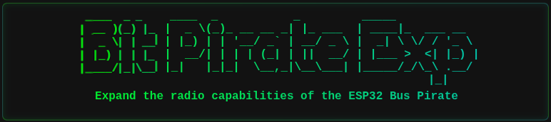](https://github.com/geo-tp/ESP32-Bus-Expander)


🔌 **[Expand the capabilities of the ESP32 Bit Pirate](https://github.com/geo-tp/ESP32-Bus-Expander)** with additional hardware modules.
The Expander adds support for the **WiFi 5 GhZ** or other radio protocols.


## Dock
[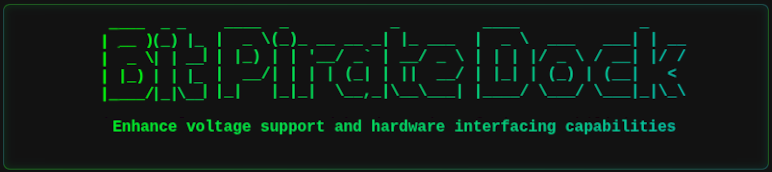](https://github.com/AndreiVladescu/ESP32-Bit-Pirate-Dock)

🔧 **[A docking station for the ESP32 S3 DevKit](https://github.com/AndreiVladescu/ESP32-Bit-Pirate-Dock) designed to work with original Bus Pirate adapters.**
It allows you to plug and use the original [Bus Pirate](https://buspirate.com/) ecosystem of adapters and accessories.


(Coming soon)

[](https://www.pcbway.com)


## Command-Line Interfaces

The ESP32 Bit Pirate firmware provides three command-line interface (CLI) modes:

| Interface         | Advantages                                                                 | Ideal for...                          |
|------------------|-----------------------------------------------------------------------------|----------------------------------------|
| **Web Interface** | - Accessible from any browser<br>- PC, tablets, mobiles<br>- Works over Wi-Fi<br>- No cables needed | Quick tests, demos, headless setups   |
| **Serial Interface** | - Faster performance<br>- Instant responsiveness<br>- Handles large data smoothly | Intensive sessions, frequent interactions |
| **Standalone** | - Only for the Cardputer<br>- On device keyboard<br>- On device screen | Portable sessions, Quick tests |


All interfaces share the same command structure and can be used interchangeably ([more details](https://github.com/geo-tp/ESP32-Bit-Pirate/wiki/00-Terminal)).

## Mobile Web Interface over WiFi
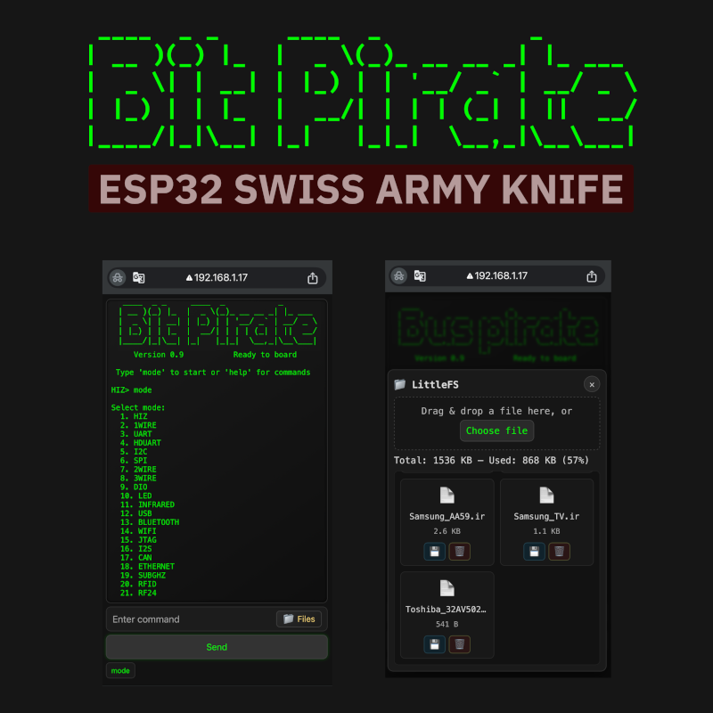

## Standalone Mode for the Cardputer


## Browser-Based Web Serial Tools

The [ESP32 Bit Pirate Web Serial Tools](https://geo-tp.github.io/ESP32-Bit-Pirate/web-tools/) provides direct access to the Serial CLI from a compatible browser, without installing PuTTY, minicom, or another terminal application.

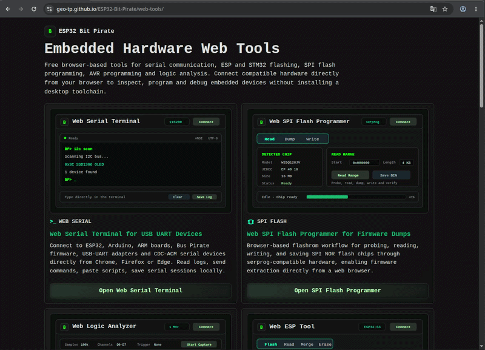

## ☠️ JimGat Fork — JARVIS AI Enabled Edition Differences

This fork intentionally keeps the core BitPirate protocol tools recognizable while adding LAN-first automation behavior for JARVIS and other local agents.

What is different from the upstream-oriented firmware:

| Area | JARVIS AI Enabled Edition behavior |
|---|---|
| Web flasher | Public multi-board flasher at <https://jimgat.github.io/ESP32-Bit-Pirate/> with JimGat-branded board binaries |
| Direct automation API | Adds `/api/status` and `/api/command` for local AI/automation clients while keeping the human Web CLI on `/ws` |
| Transport split | REST is for bounded one-shot control; WebSocket remains mandatory for streaming protocol work such as sniffers, captures, and raw RF/audio data |
| Persistent Wi-Fi | Successful `mode wifi` / `connect <ssid> <password>` stores credentials in ESP32 NVS |
| Default boot after Wi-Fi setup | If saved credentials exist and the network is reachable, boot automatically starts WiFi Client mode so Web UI, `/ws`, and `/api/*` are reachable on the LAN |
| Serial recovery | `serial-once` or a board/user-button double-click while Web UI is active starts USB Serial on the next boot only, without erasing saved Wi-Fi |
| Forget behavior | `forget` clears saved Wi-Fi credentials and disables future boot auto-connect |
| Secret handling | `saved` shows only the SSID and reports password as `[REDACTED]`; passwords are never printed |

Why: BitPirate exposes I2C, SPI, UART, CAN, OneWire, RF, logic capture, and other GPIO/protocol tooling. JARVIS and local agents need that bench instrument to come back on the LAN after reset or power loss without a human reselecting Wi-Fi every time.

The following sections describe features added in this fork at [JimGat/ESP32-Bit-Pirate](https://github.com/JimGat/ESP32-Bit-Pirate). They are designed for:

- **Compact form-factor hardware** (S3 Super Mini modules, bare castellated pins).
- **Direct network control by AI agents / automation frameworks** — JARVIS, Claude Code, or any HTTP-capable client.
- **Upstream-compatible** design so that each feature can be cherrypicked back into upstream without dragging unrelated changes.

### ESP32-S3 Super Mini

The [ESP32-S3 Super Mini](https://www.wemos.cc/en/latest/d32/d32_s3_super_mini.html) (S3-MINI-1U module class) is a ~22 × 18 mm board with the same ESP32-S3 dual-core at 240 MHz, but in a tiny castellated-pin footprint.

**Key specs in this fork:**

| Feature | S3-SuperMini env |
|---|---|
| Chip | ESP32-S3 dual-core RISC-V/Xtensa @ 240 MHz |
| Flash | 4 MB (XMC embedded) |
| PSRAM | 2 MB (AP Memory 3.3 V, OPI) |
| USB | Native USB-CDC @ 921 600 bps |
| Partition table | `max_app_4MB.csv` (4 MB safe) |
| Usable GPIOs | 1, 2, 3, 4, 5, 6, 7, 8, 9, 18 (10 I/O pins on the castellated edge) |
| Protected | 0, 19, 20 (USB D+/D-), 26–37 (flash), 33–34 (PSRAM), 45/46 (strapping), 48 (RGB if present) |

**Default pin map for the super-mini target** (set in `platformio.ini` `[env:s3-supermini]`):

- **I2C**: SDA=8, SCL=9 · 100 kHz
- **SPI**: CS=18, CLK=6, MISO=7, MOSI=5
- **UART**: RX=3, TX=4 @ default 9 600 bps
- **OneWire**: GPIO 4
- **IR**: TX=1, RX=2
- **WS2812**: Data=1, Clock=2

The pin map reuses the same role-class as the reference S3-Devkit — every protocol the DevKit supports is supported on the Super Mini, just routed onto the smaller available IO.

**Flash via the web flasher** at [https://jimgat.github.io/ESP32-Bit-Pirate/](https://jimgat.github.io/ESP32-Bit-Pirate/) — the Super Mini is a first-class board in the selector.

**Build locally:**

```bash
pio run -e s3-supermini
```

> If your specific super-mini module routes the RGB LED or USB differently, override the defaults by appending `-D LED_PIN=<gpio>` / `-D ARDUINO_USB_CDC_ON_BOOT=1` to `build_flags` for `[env:s3-supermini]`.


### Remote UART / Serial Console over LAN

The JARVIS AI Enabled Edition can be used as a LAN-accessible serial console. Default UART GPIOs are board-specific; see [Remote UART / Serial Console Wiring](docs/REMOTE_UART.md) for the full pin table and Web UI workflow.

USB Serial setup/recovery does not conflict with target UART GPIOs: USB Serial uses native USB CDC, while target UART uses `Serial1` on the configured RX/TX pins. Super Mini default UART uses header GPIO1/GPIO2, avoiding the inconvenient GPIO17/GPIO18 micro pads; its onboard WS281x-style RGB LED is configured on GPIO48.

### Persistent Wi-Fi auto-connect for local agents

The JARVIS AI Enabled Edition can automatically rejoin the last successfully configured Wi-Fi network on boot. This makes the Web CLI, WebSocket stream, and REST automation API available on the local LAN without touching the device after power-up.

Why this matters: BitPirate exposes GPIO protocol tools — I2C, SPI, UART, CAN, OneWire, RF, logic capture, and more — that local agents such as JARVIS can drive remotely. If the device always falls back to a local menu after reboot, automation loses the tool until a human reselects Wi-Fi. Persisted LAN attach turns the BitPirate into a reusable bench instrument that agents can discover and control after reboots.

Behavior:

1. `connect <ssid> <password>` connects to Wi-Fi and stores the SSID/password in ESP32 NVS.
2. On later boots, firmware checks NVS before showing the terminal-mode selector.
3. If saved credentials exist and the network is reachable, it automatically starts in Wi-Fi Client mode and launches the Web UI/API on the assigned LAN IP.
4. If the network is unavailable or credentials are missing, boot falls back to the normal terminal selection flow.
5. `serial-once` or a board/user-button double-click while Web UI is active sets a one-shot USB Serial recovery boot without erasing Wi-Fi.
6. `forget` clears the saved network so future boots stop auto-connecting.

Wi-Fi commands in `mode wifi`:

| Command | Purpose |
|---|---|
| `connect <ssid> <password>` | Connect to a network and save credentials to NVS |
| `connect` | Interactive scan/select/connect flow; successful connection is saved |
| `saved` | Show `Saved SSID: <name>` and password status as `[REDACTED]`; never reveals the password |
| `forget` | Clear saved SSID/password from NVS and disable boot auto-connect |
| `serial-once` | Start USB Serial on the next boot only; saved Wi-Fi remains intact |
| Double-click board/user button while Web UI is active | Physical recovery shortcut for `serial-once`; does not affect ROM download mode because it is used after firmware has booted |
| `status` | Show current Wi-Fi state plus saved SSID metadata |
| `disconnect` | Disconnect the current session; does not erase saved credentials |

Security note: saved passwords are used only by firmware to reconnect. The console and documentation paths intentionally expose only the SSID and redact the password.

### Automation API (REST)

This fork adds a thin JSON HTTP API intended for AI agents and other direct-automation clients. The API reuses the firmware's existing terminal dispatcher path so a programmatic command behaves identically to the same command typed in the Web CLI.

Endpoints:

| Method | Path | Purpose |
|---|---|---|
| `GET` | `/api/status` | Liveness + device/firmware/mode/IP/MAC/heap + whether a WebSocket client is attached |
| `POST` | `/api/command` | Inject a CLI command into the Web terminal queue and return bounded captured output |

**`/api/status` example response:**

```json
{
  "ok": true,
  "api_version": 1,
  "device": "ESP32-Bit-Pirate",
  "firmware": "1.5",
  "uptime_ms": 123456,
  "mode": "I2C",
  "terminal_mode": "WiFi Web",
  "terminal_ip": "192.168.1.50",
  "ip": "192.168.1.50",
  "mac": "AA:BB:CC:DD:EE:FF",
  "heap_free": 123456,
  "ws_client_connected": false,
  "auth": "none"
}
```

**`/api/command` example request/response:**

```json
// request
{
  "cmd": "mode i2c",
  "timeout_ms": 3000,
  "quiet_ms": 250,
  "max_bytes": 4096
}

// response
{
  "ok": true,
  "timeout": false,
  "duration_ms": 275,
  "mode": "I2C",
  "output": "Mode changed to I2C\nI2C> ",
  "truncated": false
}
```

The endpoint is **serial-mirrored** — a local operator watching USB Serial sees:

```text
[API RX] mode i2c
[API TX] bytes=25 timeout=false
```

This makes every remote command auditable at the bench even while an AI client controls the device over the network.

**Optional Bearer authentication.** Define `BITPIRATE_API_TOKEN=***` at compile time to require `Authorization: Bearer <token>` on `/api/*`. Without the macro the API matches the existing Web CLI posture and is unauthenticated.

**Concurrency:** Only one `/api/command` may run at a time. A concurrent call returns `HTTP 409 Conflict`.

Full API doc: [`docs/DIRECT_API.md`](docs/DIRECT_API.md).

#### Transport architecture — why WebSockets *and* REST

The firmware has two very different kinds of traffic, so it uses two transports on purpose:

| Transport | Where | Traffic shape |
|---|---|---|
| **WebSocket** (`/ws`) | Web CLI | *Control plane + unbounded protocol streams* — logic analyzer captures, I2C/SPI/UART/CAN sniffer frames, Wi-Fi/BLE scan updates, Sub-GHz raw dumps, RF24 frame flow |
| **REST API** (`/api/*`) | AI agents / automation | *Control plane only* — one-shot command dispatch, short interactive command output |

**Why WebSockets stay mandatory for real protocol work.**
BitPirate's protocol modes produce *continuous, asynchronous byte streams* — an I2C sniffer may emit thousands of events per second; a Sub-GHz capture is unbounded raw RF bytes; I2S is a live audio sample stream.

HTTP REST is request/response. Even with a polling pattern like `GET /api/logs?since=seq` every 100 ms, you would:

- miss fast transient protocol events between polls,
- waste bandwidth on HTTP headers for every single frame,
- force the ESP32 to hold an ever-growing ring buffer on the device,
- fight fixed on-chip RAM (S3 has 320 KB SRAM).

A WebSocket is one persistent TCP socket — the firmware pushes bytes the instant they happen, no per-frame HTTP overhead, no unbounded device-side buffering. The client's browser holds the memory. This is the correct model for streaming logic analysis and protocol sniffing.

**Why REST is added on top.**
AI agents and small automation scripts do *not* need a streaming socket. They do need a reliable, single-request, single-response primitive for state queries and for "type this CLI command and give me the output." The REST API provides exactly that, with a small bounded capture buffer sufficient for the short text output of interactive commands.

**Rule of thumb:**

- **Logic traces, sniffing, RF raw, I2S audio → WebSocket** (the existing `/ws` path is the right one).
- **Quick automation commands, status checks, AI-agent interaction → REST** (`/api/status`, `/api/command`).
- **Long-running captures from automation script → open a WebSocket directly**, not a `POST /api/command`.

This keeps the firmware's RAM budget sane — a big ring buffer would break protocol capture on the 320 KB SRAM boards — while still giving modern automation clients a clean entry point.

## Contribute
See [How To Contribute](https://github.com/geo-tp/ESP32-Bit-Pirate/wiki/99-Contribute) section, which outlines a **simple way to add a new command** to any mode.

## Visuals Assets

#### [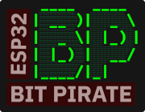](https://github.com/geo-tp/ESP32-Bit-Pirate/wiki/99-Visual-Assets)

See [images, logo, presentations, photo, video, illustrations](https://github.com/geo-tp/ESP32-Bit-Pirate/wiki/99-Visual-Assets). These visuals can be **freely used in blog posts, documentation, videos, or articles** to help explain and promote the firmware.


## Warning
> ⚠️ **Voltage Warning**: Devices should only operate at **3.3V** or **5V**.
> - Do **not** connect peripherals using other voltage levels — doing so may **damage your ESP32**.

> ⚠️ **Usage Warning**: This firmware is provided for **educational, diagnostic, and interoperability testing purposes only**.
> - Do not use it to interfere with, probe, or manipulate devices without proper authorization.
> - Avoid any unauthorized RF transmissions (e.g., sub-GHz) that could violate local regulations or disrupt networks and communications.
> - The authors are not responsible for any misuse of this software or hardware, including legal consequences resulting from unauthorized access or signal emission.
> - Always stay within the bounds of your country’s laws and responsible disclosure policies.
