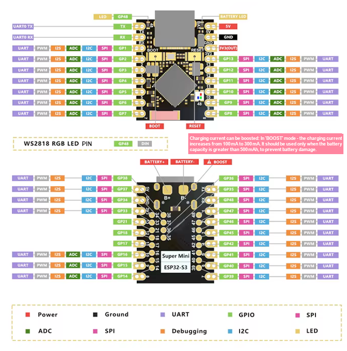

# Remote UART Serial Console

The JARVIS AI Enabled Edition can act as a LAN-accessible UART console. After the BitPirate joins Wi-Fi and boots into Web UI mode, open the Web CLI and use `mode uart` to read, write, sniff, or bridge a target serial console.

## Basic wiring

Wire crossed UART plus common ground:

| Target device | BitPirate |
|---|---|
| Target TX | BitPirate RX GPIO |
| Target RX | BitPirate TX GPIO |
| Target GND | BitPirate GND |

Rules:

- Use 3.3V UART logic only. Do not feed 5V UART into ESP32 GPIO.
- Do not connect target VCC unless you intentionally want to power something and have verified current/voltage limits.
- Keep grounds common.
- Start with 115200 8N1 unless the target uses another serial format.

## Default UART pins by web-flasher target

| Web flasher target | BitPirate RX GPIO | BitPirate TX GPIO | Wiring |
|---|---:|---:|---|
| ESP32-S3 DevKit | GPIO17 | GPIO18 | Target TX -> 17, Target RX -> 18 |
| ESP32-S3 Super Mini | GPIO1 | GPIO2 | Target TX -> 1, Target RX -> 2 |
| M5Stack Cardputer Adv | GPIO1 | GPIO2 | Target TX -> 1, Target RX -> 2 |
| M5Stack StickS3 | GPIO4 | GPIO5 | Target TX -> 4, Target RX -> 5 |
| LILYGO T-Display S3 | GPIO44 | GPIO43 | Target TX -> 44, Target RX -> 43 |
| LILYGO T-Embed S3 | GPIO44 | GPIO43 | Target TX -> 44, Target RX -> 43 |
| LILYGO T-Embed S3 CC1101 | GPIO44 | GPIO43 | Target TX -> 44, Target RX -> 43 |
| LILYGO T-Embed S3 CC1101+ | GPIO18 | GPIO8 | Target TX -> 18, Target RX -> 8 |
| Seeed XIAO ESP32-S3 | GPIO1 | GPIO2 | Target TX -> 1, Target RX -> 2 |

For the S3 Super Mini build, the recommended default bench wiring is:

- BitPirate GPIO1 = RX, connect target TX
- BitPirate GPIO2 = TX, connect target RX
- BitPirate GND = target GND

For the S3 DevKit build, the default is GPIO17 RX / GPIO18 TX.


Note: on the ESP32-S3 Super Mini, GPIO17/GPIO18 are inconvenient micro pads on common boards, so the JimGat web-flasher build defaults UART to the normal header pins GPIO1/GPIO2. The onboard WS281x-style RGB LED is configured on GPIO48 for BitPirate multicolor status use.


## ESP32-S3 Super Mini pinout reference

For the ESP32-S3 Super Mini, prefer the normal side header pins GPIO1-GPIO13 for bench wiring. The JimGat build defaults UART to GPIO1/GPIO2 because GPIO17/GPIO18 are inconvenient micro pads on common Super Mini boards.

Translated pinout reference:



Original forum image/reference: <https://forum.fritzing.org/t/part-request-esp32-s3-supermini/22633>

Additional reference: espboards.dev Super Mini page, useful for board specs and pinout cross-checking: <https://www.espboards.dev/esp32/esp32-s3-super-mini/>

Local assets in the wiki draft include a high-resolution original pinout JPEG and a lower-resolution translated PNG.

## Web UI workflow

1. Put BitPirate on Wi-Fi once:
   ```text
   mode wifi
   connect <ssid> <password>
   saved
   ```
2. Reset normally. Saved Wi-Fi credentials auto-start WiFi Client mode.
3. Open the Web UI shown by the device/router.
4. In the Web CLI:
   ```text
   mode uart
   config
   ```
5. Confirm or change RX/TX pins, baud, data bits, parity, stop bits, and inversion.
6. Use UART commands:

| Command | Purpose |
|---|---|
| `read` | Stream ASCII UART receive until Enter |
| `raw` or `read raw` | Stream hex dump until Enter |
| `write <text>` | Send text at the configured baud |
| `bridge` | Full-duplex interactive bridge through the Web CLI |
| `sniff` / `sniff raw` | Monitor UART traffic |
| `autobaud` | Estimate baud from edges on RX |
| `swap` | Swap configured RX/TX GPIOs |


### Super Mini TX/RX labels vs USB Serial

Some ESP32-S3 Super Mini boards expose pins labeled `TX` / `RX` for UART0. Those pins are not the same physical connection as the USB Serial console used by this firmware. The BitPirate USB Serial console uses native USB CDC over the USB connector.

The JimGat Super Mini build still defaults remote target UART to GPIO1/GPIO2 because they are normal, convenient header pins. Use UART0-labeled TX/RX only if you intentionally configure those GPIOs and understand any boot-log/programming side effects.

## USB Serial console vs target UART GPIOs

The USB Serial console does not conflict with the target UART pins.

- USB Serial terminal uses the ESP32 native USB CDC connection (`Serial` / `hostSerial`).
- Target UART mode uses hardware UART `Serial1` on the configured GPIO RX/TX pair.

That means you can use USB Serial for setup/recovery and still use GPIO17/GPIO18, GPIO44/GPIO43, etc. as the target UART connection.

The only time USB takes over as the target serial transport is the dedicated `USB-UART bridge` adapter mode. That mode is different from Web UI `mode uart`: it reboots into a local USB CDC bridge for a computer physically connected to the BitPirate over USB.

## Recovery

If saved Wi-Fi makes the device boot directly to Web UI but you need USB Serial once:

- From Web UI/API: run `mode wifi`, then `serial-once`.
- Physical: double-click the board/user button while Web UI mode is active.

Both paths start USB Serial on the next boot only and keep saved Wi-Fi credentials. Use `forget` only when you want to erase saved Wi-Fi and disable future auto-connect.

Holding BOOT during reset/power-up is unchanged: it enters ESP32 ROM download/programming mode. The recovery double-click is only after firmware is already running.
